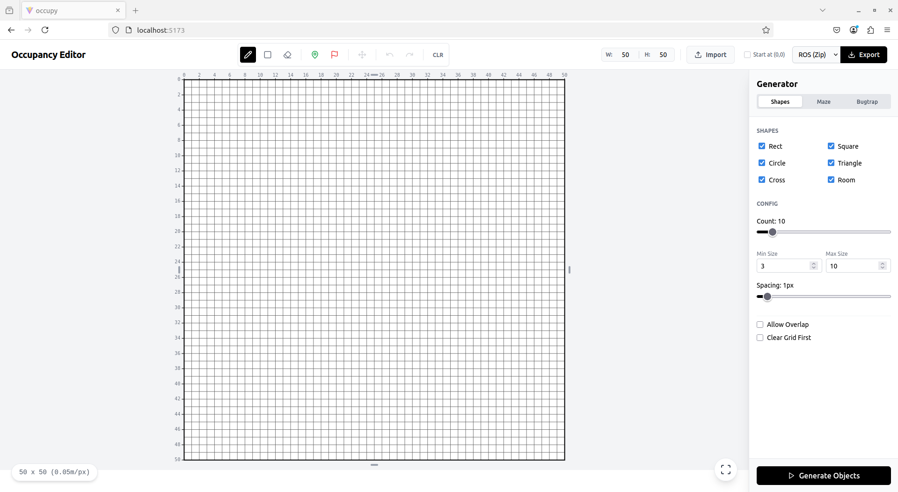
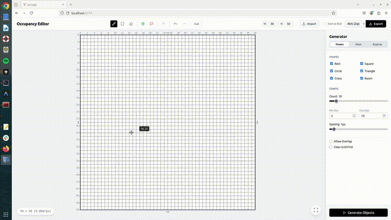
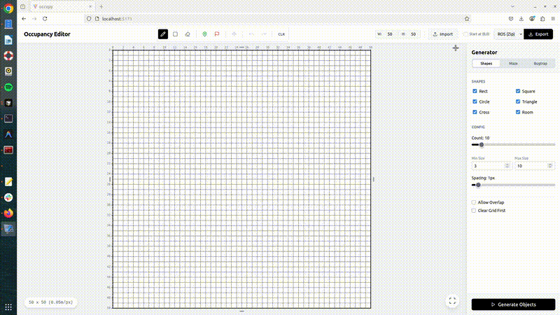

# Occupancy Editor

**https://serboba.github.io/occupancy-editor/**

A modern web-based occupancy grid editor for robotics. Create, edit, and export occupancy maps with support for ROS, CSV, JSON, and PNG formats. Features include start/goal placement, relative coordinate systems, and grid generation tools.



## Features

### 🛠️ Editor Tools
- **Drawing Tools**: Pencil, Rectangle, and Eraser for precise map creation
- **Start/Goal Points**: Set navigation start and goal positions with visual markers
- **Interactive Resizing**: Dynamically expand or crop your map in any direction
- **Recenter View**: Center the viewport on the start point
- **Relative Coordinates**: Display coordinates relative to the start point (0,0 at start)

### 🎲 Procedural Generation
Built-in tools to generate test environments:
- **Maze Generator**: Recursive Backtracker algorithm for perfect mazes
- **Bugtrap Generator**: Creates U-shaped local minima traps for testing
- **Random Obstacles**: Scatter geometric shapes with rejection sampling

### 📤 Export Formats
- **ROS**: Standard `.pgm` and `.yaml` files for `nav2_map_server`
- **CSV**: Grid data with start/goal metadata
- **JSON**: Complete grid state with metadata
- **PNG**: Visual representation of the occupancy grid
- **Start at (0,0)**: Option to export with origin shifted to start point

### ⚡ Technical Highlights
- **Stack**: React, TypeScript, Vite
- **Performance**: Canvas-based rendering optimized for large grids
- **Zero-Install**: Runs entirely in the browser
- **No Backend**: Fully client-side application

## Getting Started

### Prerequisites
- Node.js (v18 or higher)

### Installation
1. Clone the repository:
   ```bash
   git clone git@github.com:serboba/occupancy-editor.git
   cd occupancy-editor
   ```

2. Install dependencies:
   ```bash
   npm install
   ```

### Running Locally
Start the development server:
```bash
npm run dev
```
Open [http://localhost:5173](http://localhost:5173) to view the editor.

### Building for Production
   ```bash
   npm run build
   ```
The `dist/` directory contains the static files ready for deployment.

## Usage

1. **Draw Your Map**: Use the pencil, rectangle, or eraser tools to create obstacles
2. **Set Start/Goal**: Click the start/goal buttons and place points on the map
3. **Adjust View**: Pan (right-click drag), zoom (mouse wheel), or use "Center on Start"
4. **Toggle Coordinates**: Enable "Use (0,0) at Start" to see relative coordinates
5. **Export**: Choose your format (ROS, CSV, JSON, or PNG) and download

## Demo

### Drawing and Editing


### Export and Features


## Contributing

Contributions are welcome! Please feel free to submit a Pull Request.

1. Fork the Project
2. Create your Feature Branch (`git checkout -b feature/AmazingFeature`)
3. Commit your Changes (`git commit -m 'Add some AmazingFeature'`)
4. Push to the Branch (`git push origin feature/AmazingFeature`)
5. Open a Pull Request

## License

Distributed under the MIT License. See `LICENSE` for more information.
